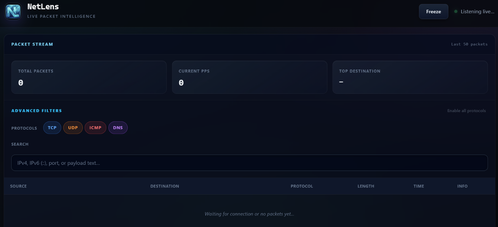

<div align="center">

# NetLens


**Real-time network observability for Windows**

[](https://github.com/your-org/netlens/releases)
[](https://www.microsoft.com/windows)
[](LICENSE)
[](https://go.dev/)
[](https://nodejs.org/)

</div>

---

## Introduction

**NetLens** is a Windows-first network observability tool that turns raw interface traffic into a live, queryable picture of what your system is doing on the wire. Most users see “the internet works” or a firewall log—NetLens closes the gap with **packet-level visibility**, **deep inspection** (TLS SNI, HTTP hints, DNS queries), and a **low-latency dashboard** fed straight from a native capture engine.

The stack is deliberately split: **Go** owns the hot path (libpcap/Npcap, decoding, DPI, WebSocket broadcast) for predictable performance and minimal overhead. **Node.js** powers the modern web UI toolchain (npm, Vite, React)—no Python, no cross-platform compromise on the capture path. If you need to reason about **bandwidth**, **endpoints**, and **protocol mix** on a busy Windows host, NetLens is built to keep up.

<p align="center">
  <b>Dashboard preview</b><br /><br />
  <br />
  <sub><i>Live capture UI — filters, PPS / top-destination metrics, protocol-colored rows, and side-panel payload inspection.</i></sub>
</p>

---

## Key Features

- **Live packet stream** — TCP, UDP, ICMPv4/ICMPv6 over IPv4/IPv6, pushed in real time over WebSockets.
- **Deep visibility** — TLS Client Hello **SNI**, HTTP request line + **Host**, DNS **query names**; raw **payload** preview (text or `hex:`) for forensics.
- **Operator-grade UI** — Filter by protocol (TCP / UDP / ICMP / DNS), search IPs and payload strings, **freeze** the stream, PPS and **top destination** stats, row-level **packet detail** panel.
- **Windows-native capture** — Uses **Npcap** (WinPcap successor) via gopacket; configure your interface from `.env`.
- **Geo-IP mapping (roadmap)** — Planned visualization of traffic destinations on a world map.

---

## Architecture Overview

```
┌─────────────────────────────────────────────────────────────┐
│  Windows + Npcap                                             │
│  ┌──────────────────┐         WebSocket (JSON)   ┌────────┐ │
│  │  Go capture svc   │ ─────────────────────────► │ Browser │ │
│  │  gopacket + DPI   │      localhost:8080/ws      │ React   │ │
│  └──────────────────┘                             │ (Vite)  │ │
└─────────────────────────────────────────────────────────────┘
```

The **Go** binary opens a live pcap handle, decodes IPv4/IPv6, classifies transport layers, enriches select flows with application-layer hints, and **marshals** `PacketData` structs to JSON for each connected WebSocket client. The **Node.js** side does not sit in the capture loop: it **builds and serves** the SPA during development (`vite dev`) or produces static assets for production (`vite build`). The browser connects to the Go server for the telemetry channel—clear separation of **data plane** (Go) and **presentation** (Node/npm ecosystem).

---

## Prerequisites

| Requirement | Notes |
|-------------|--------|
| **Windows 10/11** (x64) | Primary target; capture APIs and paths assume Windows. |
| **[Npcap](https://npcap.com/)** | Install with “WinPcap API-compatible mode” if prompted; required for gopacket/pcap. |
| **Go** | 1.26+ recommended (`go.mod` specifies the toolchain in use). |
| **Node.js** | Current **LTS**; npm ships with it. |

---

## Installation

From **PowerShell** or **Command Prompt** (adjust paths if your clone location differs).

```powershell
# Clone
<<<<<<< HEAD
git clone https://github.com/BBaglars/NetLens.git
cd Netlens
=======
git clone https://github.com/your-org/netlens.git
cd netlens
>>>>>>> 4b0b9ad9f8c4d791c8875490afd1cd98d7bd35f7

# Go backend — fetch modules and build
cd backend
go mod download
cd ..

# Frontend — install dependencies
cd frontend
npm install
cd ..
```

### Environment

Create a `.env` file in the directory from which you run the Go binary (commonly `backend/` or repo root, matching `godotenv.Load()` usage):

```env
NETWORK_INTERFACE=\Device\NPF_{XXXXXXXX-XXXX-XXXX-XXXX-XXXXXXXXXXXX}
```

Use `Get-NetAdapter` / Npcap documentation / Wireshark’s capture list to resolve the correct **`\Device\NPF_{...}`** name.

---

## Usage

**Terminal 1 — capture + WebSocket API**

```powershell
cd backend
go run main.go
```

You should see the HTTP/WebSocket listener on **port 8080** (e.g. `ListenAndServe(":8080")`).

**Terminal 2 — dashboard (development)**

```powershell
cd frontend
npm run dev
```

Open the URL Vite prints (typically `http://localhost:5173`). The UI connects to **`ws://localhost:8080/ws`**.

**Production UI (static files)**

```powershell
cd frontend
npm run build
npm run preview
# or serve `frontend/dist` with any static file server; ensure CORS/WebSocket origin policy matches your deployment.
```

---

## Roadmap

| Item | Description |
|------|-------------|
| **Geo-IP mapping** | Map destination IPs to countries/regions; optional map view in the dashboard. |
| **Per-application bandwidth** | Correlate flows with owning process (where OS APIs allow) for app-level charts. |
| **Anomaly hints** | Heuristics or baselines for unusual ports, volumes, or DNS patterns. |
| **Persistence & replay** | Optional PCAP export or ring buffer for post-incident review. |
| **Hardened deployment** | TLS for WebSocket, auth, and configurable bind addresses for non-local use. |

---

## Contributing

Contributions are welcome. Please open an **issue** first for substantial changes. Use consistent formatting (`gofmt`, ESLint/Prettier as configured in `frontend`), and keep commits focused. Pull requests should describe **what** changed and **why**, and must not introduce non-Windows capture paths unless explicitly scoped behind build tags.

---

## License

This project is licensed under the **MIT License** — see the [`LICENSE`](LICENSE) file for details.

---

<div align="center">

**NetLens** — *See the traffic your OS is really sending.*

</div>
